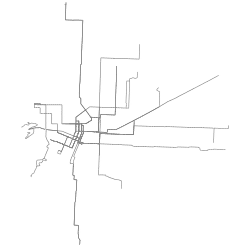

## Portland Atlas

* Easily download and convert public data for Portland, Oregon.
* Generate [TopoJSON](https://github.com/mbostock/topojson) for Portland Neigborhoods, combined with [demographic data](http://www.portlandoregon.gov/oni/28387).
* Generate png images from shapefiles

### Install

```
npm install portland-atlas
```

### Examples

```
make shp/neighborhoods.shp
make topo/neighborhoods.json
make topo/neighborhoods-demographics.json
make png/neighborhoods.png
```

... | ... | ... |...
:---: | :---: | :---: | :---:
 **bicycle network** |  **bicycle parking** |  **bridges**
 **building footprints** |  **business associations** |  **cip data** |  **city boundaries**
 **contours 5ft** |  **corners** |  **counties** |  **curb ramps**
 **curbs** |  **development opportunity areas** |  **enterprise ecommerce zone** |  **freight districts**
 **freight facilities** |  **guardrail** |  **heritage trees** |  **historic trolleys**
 **homebuyer opportunity areas** |  **intermodal facilities** |  **its camera** |  **its sign**
 **leaf pickup** |  **lid boundaries** |  **lid streets** |  **neighborhoods**
 **parking meters** |  **parks easements** |  **parks taxlots** |  **parks trails**
 **parks vegetation surveys** |  **parks** |  **pavement maint** |  **pavemoratorium**
 **pedestrian districts** |  **percent slope** |  **portland streets permit jobs line** |  **portland streets permit jobs point**
 **portland streets permit jobs polygon** |  **portland transit stations** |  **portland tsp classifications** |  **portland tsp district boundaries**
 **sidewalks** |  **signage lighting improvement program** |  **snow ice routes** |  **storefront improvement areas**
 **street contract jobs line** |  **street contract jobs multipoint** |  **street sweeping** |  **street trees**
 **streets** |  **traffic calming** |  **traffic signal** |  **urban renewal areas**
 **watersheds** |  **wellhead prot areas** |  **zipcodes** |  **zoning data**
