## Portland Atlas

* Easily download and convert public GIS (shapefile) data for Portland, Oregon.
* Generate png images from Shapefiles


This project was influenced by [world-atlas](https://github.com/mbostock/world-atlas).


### Install

It's best to clone the repository and work directly from the project directory since most features are controlled through the Makefile.
```
git clone https://github.com/Caged/portland-atlas.git
```

### Examples

```
make shp/neighborhoods.shp
make topo/neighborhoods.json
make png/neighborhoods.png
```
... | ... | ...  
:---: | :---: | :---:  
 **bicycle network** |  **bicycle parking** | 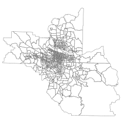 **blockgroup 1990**  
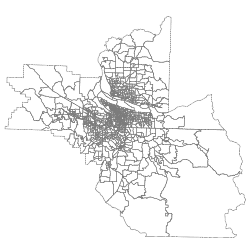 **blockgroup 2000** | 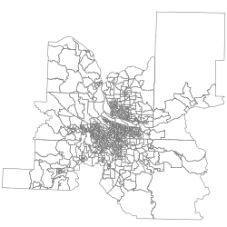 **blockgroup 2010** | 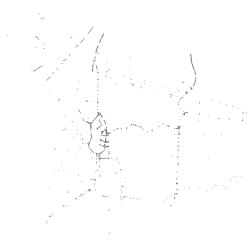 **bridges**  
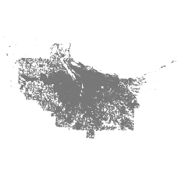 **buildings** | 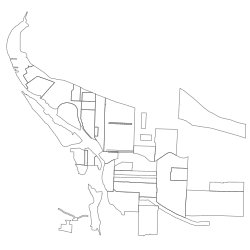 **business associations** | 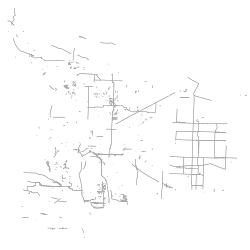 **cip data**  
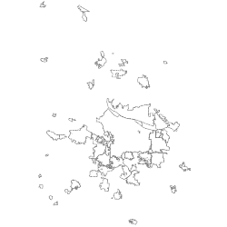 **city boundaries** | 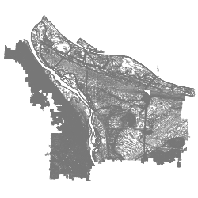 **contours 5ft** | 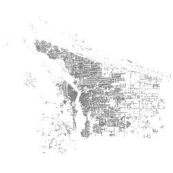 **corners**  
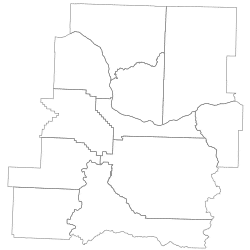 **counties** | 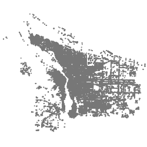 **curb ramps** | 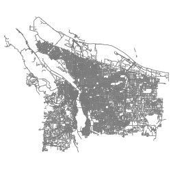 **curbs**  
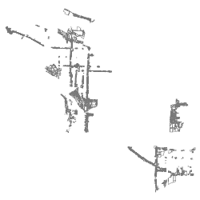 **development opportunity areas** | 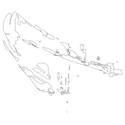 **enterprise ecommerce zone** | 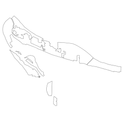 **freight districts**  
 **freight facilities** | 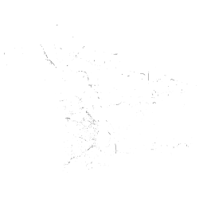 **guardrail** | 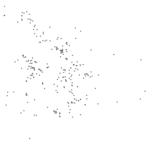 **heritage trees**  
 **historic trolleys** | 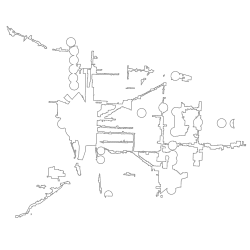 **homebuyer opportunity areas** |  **intermodal facilities**  
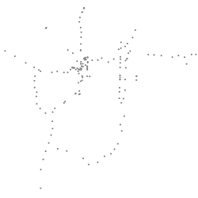 **its camera** |  **its sign** |  **leaf pickup**  
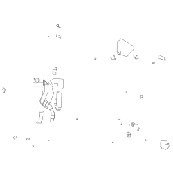 **lid boundaries** |  **lid streets** | 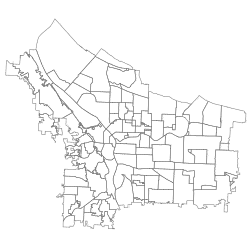 **neighborhoods**  
 **parking meters** | 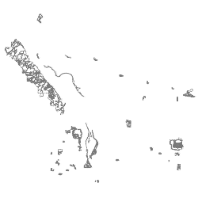 **parks desired future cond** | 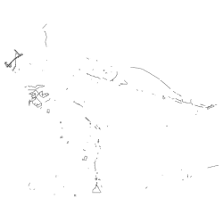 **parks easements**  
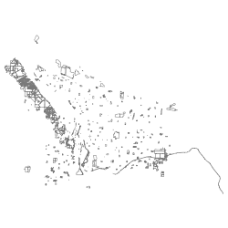 **parks taxlots** | 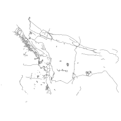 **parks trails** | 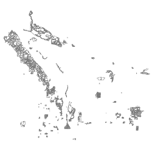 **parks vegetation surveys**  
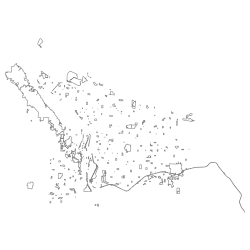 **parks** | 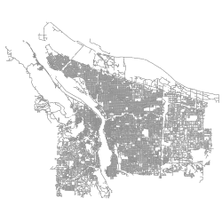 **pavement maint** | 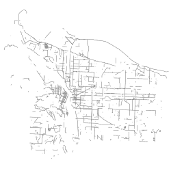 **pavemoratorium**  
 **pedestrian districts** | 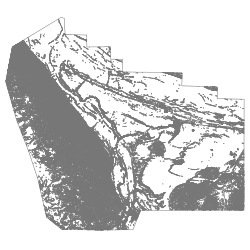 **percent slope** | 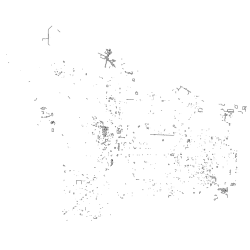 **portland streets permit jobs line**  
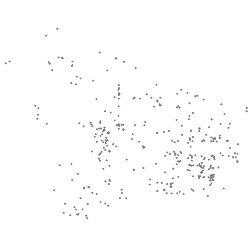 **portland streets permit jobs point** |  **portland streets permit jobs polygon** | 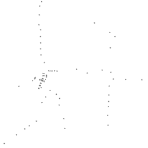 **portland transit stations**  
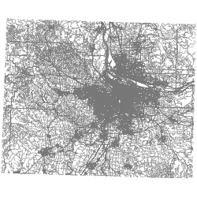 **portland_oregon_osm_line** | 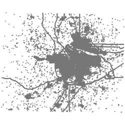 **portland_oregon_osm_point** |  **portland_oregon_osm_polygon**  
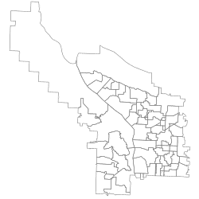 **school attendance areas** |  **sidewalks** | 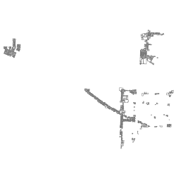 **signage lighting improvement program**  
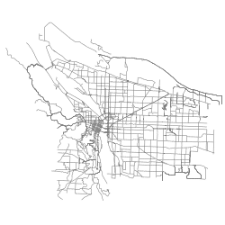 **snow ice routes** | 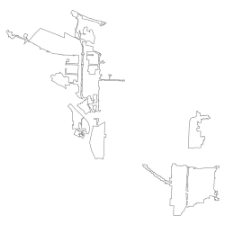 **storefront improvement areas** | 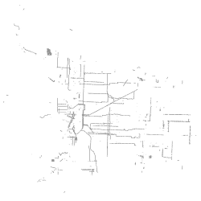 **street contract jobs line**  
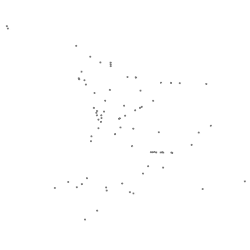 **street contract jobs multipoint** | 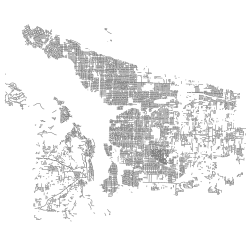 **street sweeping** | 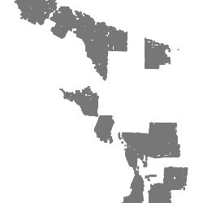 **street trees**  
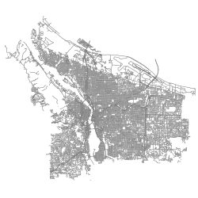 **streets** | 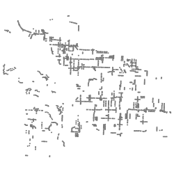 **traffic calming** | 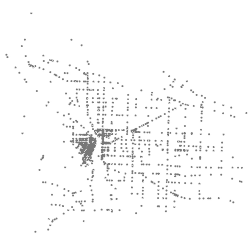 **traffic signal**  
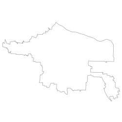 **trimet boundary** | 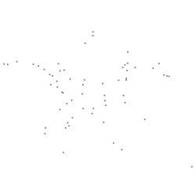 **trimet park and rides** | 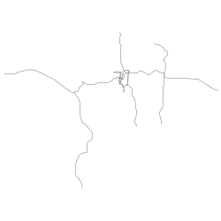 **trimet rail lines**  
 **trimet rail stops** |  **trimet route stops** |  **trimet routes**  
 **trimet stops** |  **trimet transit centers** |  **tsp classifications**  
 **tsp district boundaries** |  **urban growth boundary history** |  **urban growth boundary**  
 **urban renewal areas** |  **vegetation** |  **water**  
 **watersheds** |  **wellhead prot areas** |  **zipcodes**  
 **zoning_anno_pdx** |  **zoning_arrows_pdx** |  **zoning_pdx**  
