## Portland Atlas

Demographic data field definitions can be found here: http://www.portlandoregon.gov/oni/28387

... | ... | ... | ...
--- | --- | --- | ---
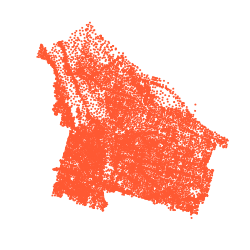 | 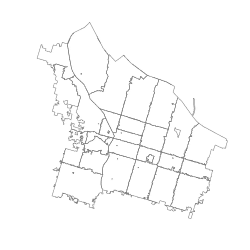 | 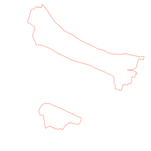 | 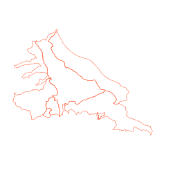
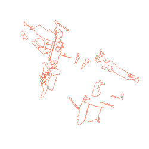 | 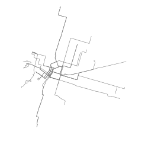 | 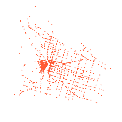 | 
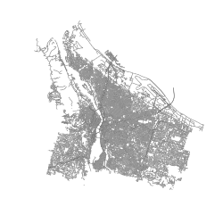 | 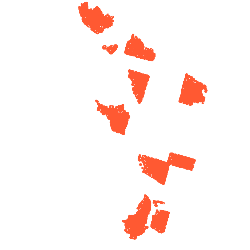 | 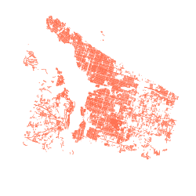 | 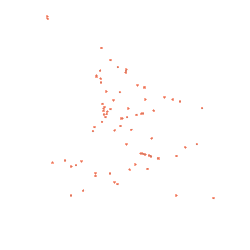
 | 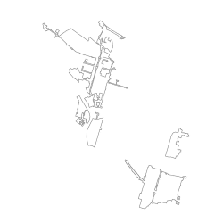 | 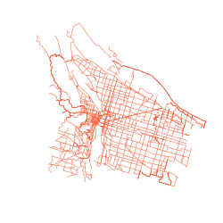 | 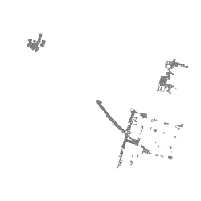
 | 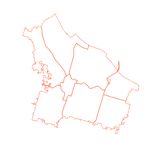 | 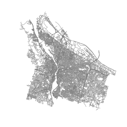 | 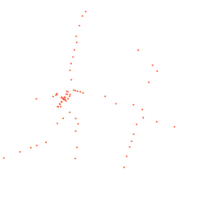
 |  | 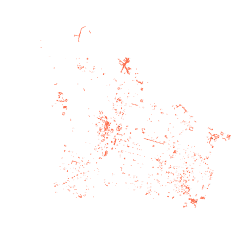 | 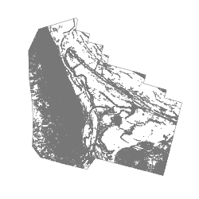
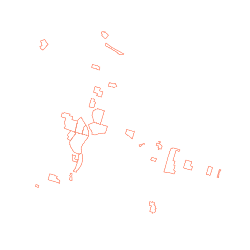 |  |  | 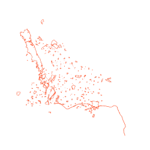
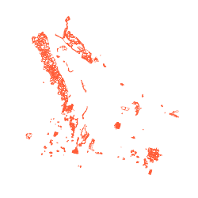 | 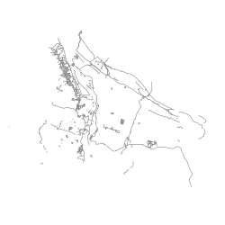 |  | 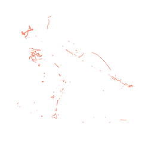
 | 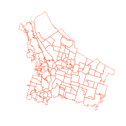 | 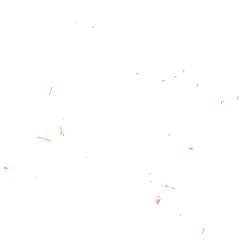 | 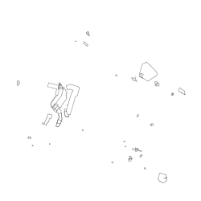
 |  | 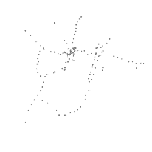 | 
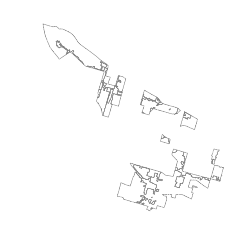 | 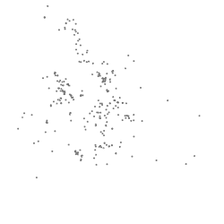 |  | 
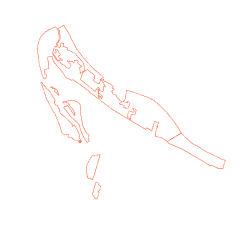 | 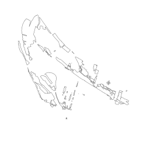 | 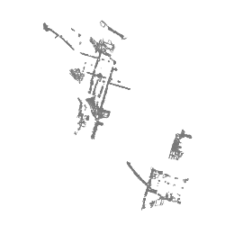 | 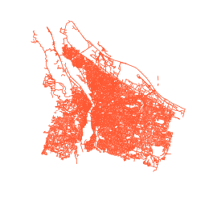
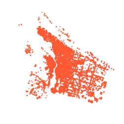 | 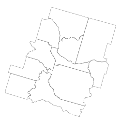 | 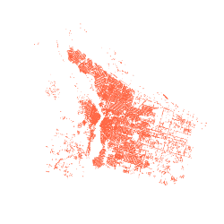 | 
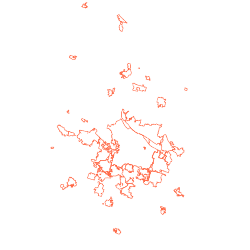 | 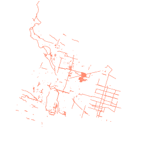 | 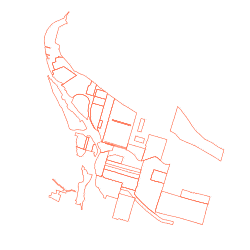 | 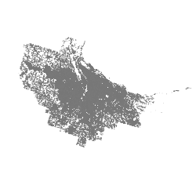
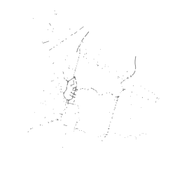 | 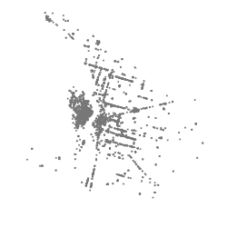 | 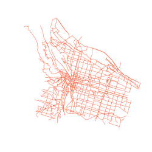 |

end table